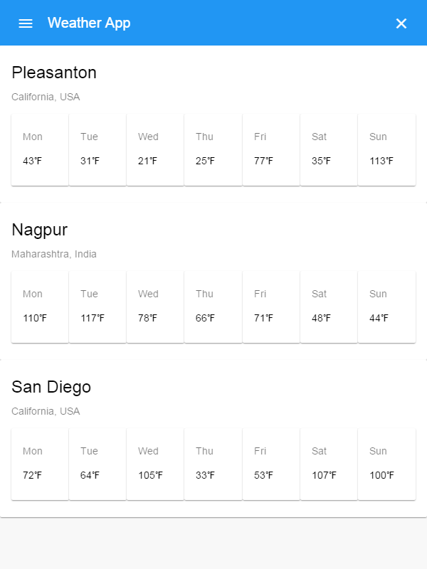
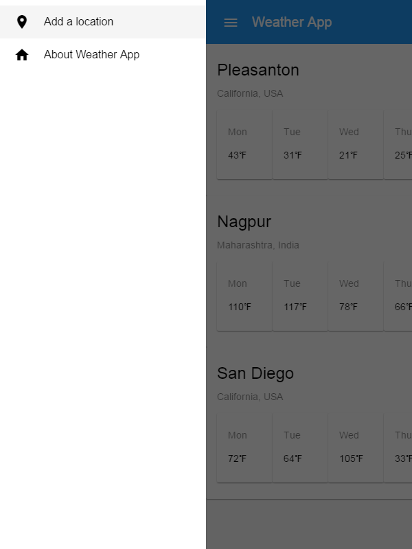

# WeatherApp

This is a simple Weather App using Electron, Angular 2, Angular Material. Checkout the index.html file for how I deal with issue of

```
<base href="/">
```
to work in Electron app as well as web application.





## To run as electron app do:

> npm start

## To run as web application do:

> ng server
